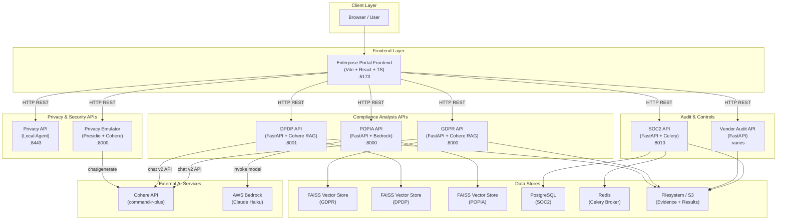
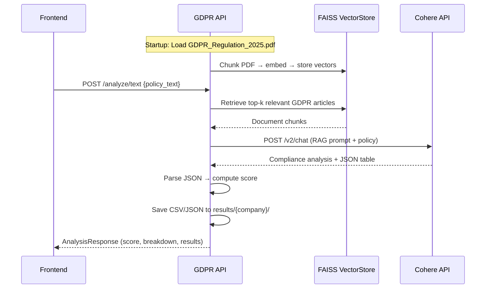
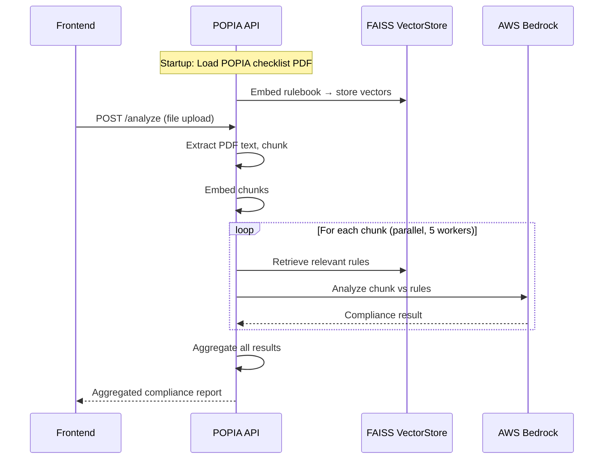
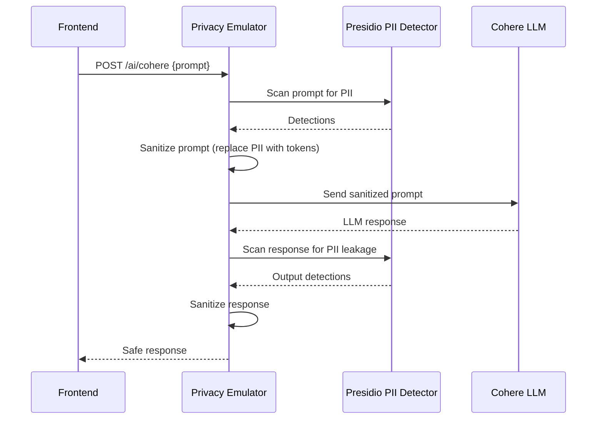
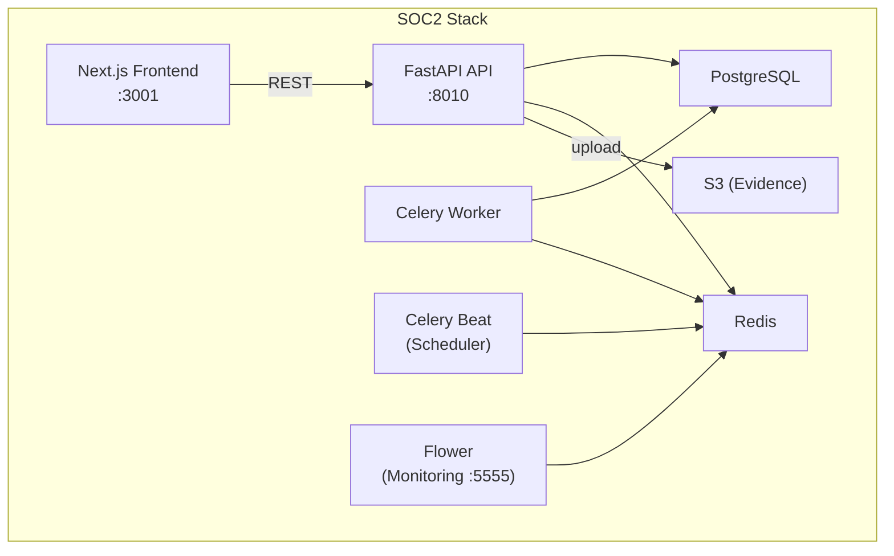
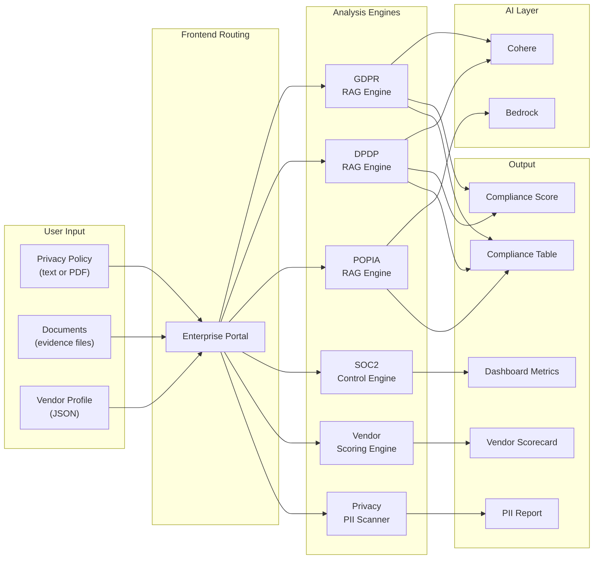
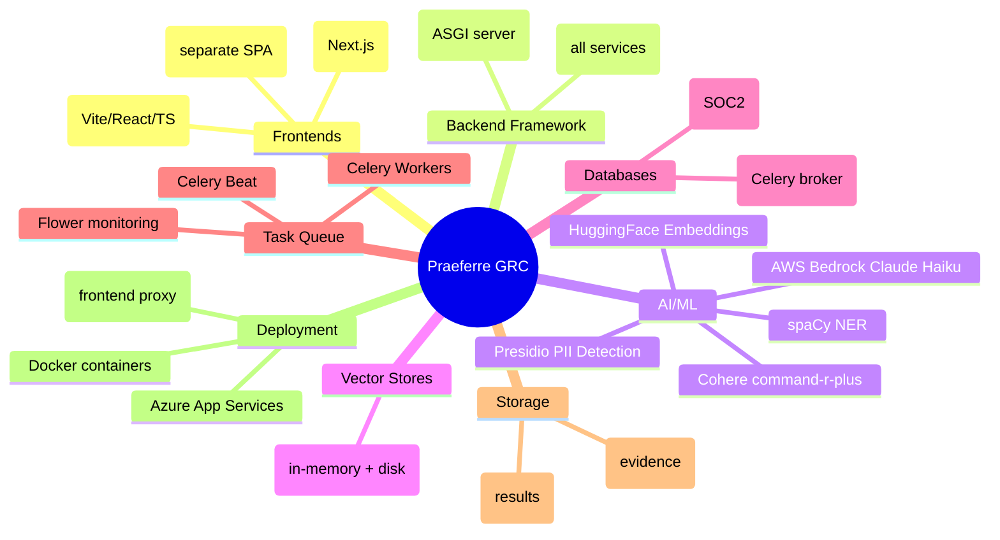

# Praeferre GRC Platform — Microservices Architecture Walkthrough

## 1. Platform Overview

Praeferre is a **Governance, Risk & Compliance (GRC)** platform built as a collection of independent microservices. Each service handles a specific regulatory framework or capability, and the **Enterprise Portal Frontend** acts as the unified orchestration layer that stitches them together into one dashboard.

### Services Inventory

| # | Service | Tech Stack | Default Port | Purpose |
|---|---------|-----------|-------------|---------|
| 1 | **Enterprise Portal Frontend** | Vite + React + TypeScript | `5173` | Unified GRC dashboard |
| 2 | **GDPR API** | FastAPI + LangChain + Cohere | `8000` | EU GDPR compliance analysis |
| 3 | **DPDP API** | FastAPI + LangChain + Cohere | `8001` | India DPDP compliance analysis |
| 4 | **POPIA API** | FastAPI + AWS Bedrock | `8000` | South Africa POPIA compliance |
| 5 | **Privacy API (Local Agent)** | FastAPI + PII Detector | `8443` | PII detection firewall |
| 6 | **Privacy API Emulator** | FastAPI + Presidio + Cohere | `8000` | Full privacy emulator with LLM guardrails |
| 7 | **SOC2 System Scanning** | FastAPI + PostgreSQL + Celery + Next.js | `8010` / `3001` | SOC2 audit & controls management |
| 8 | **Vendor Audit** | FastAPI + Pydantic | varies | Third-party vendor risk scoring |

---

## 2. High-Level Architecture



---

## 3. Communication Patterns

### 3.1 Frontend → Backend (HTTP REST)

All microservices are consumed by the frontend via **direct HTTP REST calls**. There is **no API gateway, service mesh, or message queue** between the frontend and the backends. Each service has its own base URL configured via `VITE_*` environment variables:

```
VITE_GDPR_API_URL     → GDPR API
VITE_DPDP_API_URL     → DPDP API
VITE_POPIA_API_URL    → POPIA API (via VITE_PIPA_API_URL)
VITE_PRIVACY_API_URL  → Privacy API
VITE_SOC2_API_URL     → SOC2 API
VITE_VENDOR_API_URL   → Vendor Audit API
```

The frontend uses two HTTP client strategies:
- **`fetch()` API** — Used by `gdprApiService.ts`, `dpdpApiService.ts`, `soc2ApiService.ts`
- **`axios`** — Used by `pipaApiService.ts`, `privacyApiService.ts`, and the base `api.ts` service

### 3.2 Authentication Methods

| Service | Auth Method |
|---------|------------|
| GDPR API | None (open CORS) |
| DPDP API | None (open CORS) |
| POPIA API | None |
| Privacy Local Agent | HTTP Bearer token |
| Privacy Emulator | `x-api-key` header |
| SOC2 API | `x-api-key` header + org-scoped token auth |
| Vendor Audit | `x-api-key` header (optional) |

### 3.3 Backend → External AI (HTTP REST)

The compliance APIs call external LLM providers:
- **GDPR & DPDP** → Cohere Chat v2 API (`https://api.cohere.ai/v2/chat`)
- **POPIA** → AWS Bedrock (Claude Haiku via `boto3`)
- **Privacy Emulator** → Cohere Python SDK (`cohere.Client`)

### 3.4 Inter-Service Communication

> [!IMPORTANT]
> The backend microservices **do NOT communicate with each other directly**. All orchestration happens in the frontend. Each service is fully independent and stateless relative to the others.

---

## 4. Per-Service Deep Dive

### 4.1 GDPR Compliance API

**Location:** [app.py](file:///d:/Praeferre/gdpr-api-main/app.py)



**Key details:**
- **Storage:** In-memory FAISS vector store (rebuilt on startup from PDF), results saved to filesystem
- **LLM:** Cohere `command-r-plus-08-2024`, temperature=0 for deterministic output
- **Embeddings:** HuggingFace `sentence-transformers/all-MiniLM-L6-v2`
- **Endpoints:** `/analyze/text`, `/analyze/file`, `/health`, `/requirements`, `/list-companies`, `/download/{company}/{file}`

---

### 4.2 DPDP Compliance API

**Location:** [app.py](file:///d:/Praeferre/dpdp-api-main/app.py)

Architecturally **identical** to the GDPR API but targets India's Digital Personal Data Protection Act. Uses `DPDP-2025.pdf` as the regulation source. Runs on port `8001`.

Same RAG pipeline: PDF → chunks → FAISS → Cohere LLM → compliance table.

---

### 4.3 POPIA Compliance API

**Location:** [main.py](file:///d:/Praeferre/popia-api-main/POPIA_Compliance/app/main.py)



**Key differences from GDPR/DPDP:**
- Uses **AWS Bedrock** (Claude Haiku) instead of Cohere
- Uses **ThreadPoolExecutor** for parallel chunk analysis
- Embeddings stored in local FAISS index file on disk
- File-upload only (no text analysis endpoint)

---

### 4.4 Privacy API (Local Agent)

**Location:** [main.py](file:///d:/Praeferre/privacy-api-main/main.py)

A **local-first PII detection firewall** that runs on the user's machine. It scans text, files, and images for personally identifiable information.

**Capabilities:**
- **PII Detection** — Regex + NLP-based entity recognition
- **OCR Processing** — Extract text from images, then scan for PII
- **PDF Processing** — Extract text from PDFs, then scan for PII
- **SSL/TLS** — Designed to run with self-signed certs on `localhost:8443`

**Endpoints:** `/analyze/content`, `/analyze/file`, `/ocr/process`, `/health`, `/capabilities`

---

### 4.5 Privacy API Emulator

**Location:** [main.py](file:///d:/Praeferre/privacy-api-emulator-main/backend/privacy-api/main.py)

A **full-featured privacy API** with integrated LLM guardrails. This is the production-grade version of the Privacy API.



**Key features:**
- **Double guardrail** — PII is stripped from BOTH input and output
- **Presidio-based** detection with spaCy NER model
- **Feedback loop** — `/feedback` endpoint for correcting false positives
- **Pattern registry** — `/registry/suggestions` and `/registry/promote` for custom PII patterns

---

### 4.6 SOC2 System Scanning

**Location:** [backend/main.py](file:///d:/Praeferre/soc2-system-scanning-main/backend/main.py)

The most complex service — a **full SOC2 audit management platform** with its own database, task queue, and frontend.



**Data model (PostgreSQL):**
- `Organization` — multi-tenant org with audit periods
- `User` — team members with roles (owner/admin/member/auditor)
- `ControlTemplate` — SOC2 TSC control definitions
- `OrgControl` — per-org control status (pass/fail/manual)
- `Evidence` — uploaded files linked to controls (S3 or DB blob)
- `Task` — remediation tasks with priority and assignment
- `Policy` — organizational policies with acknowledgment tracking
- `AWSCheckResult` — automated AWS security scan results

**Celery workers** handle background tasks like automated scanning and evidence analysis.

---

### 4.7 Vendor Audit API

**Location:** [api.py](file:///d:/Praeferre/Vendor_Audit-main/Vendor_Data/api.py)

A **vendor risk scoring engine** that evaluates third-party vendors against compliance controls.

**Core flow:**
1. **Collect evidence** — Scrape vendor docs from URLs, files, or Atlassian
2. **Extract facts** — Retention periods, breach response times, certifications, sub-processors
3. **Score vendor** — Weighted scoring engine against control library
4. **Generate scorecard** — JSON output suitable for dashboard rendering

**Endpoints:** `/assess`, `/collect`, `/upload-evidence`, `/submit`, `/submissions`

---

## 5. Data Flow Architecture



---

## 6. Deployment Topology

### Production (Azure)

All services are deployed as **Azure App Services** (PaaS), each with its own Azure URL:

| Service | Azure URL |
|---------|-----------|
| Frontend | `praeferre-demo-frontend-*.azurewebsites.net` |
| GDPR API | `praeferre-demo-gdpr-api-*.azurewebsites.net` |
| DPDP API | `praeferre-demo-dpdp-api-*.azurewebsites.net` |
| SOC2 Doc API | `praeferre-demo-soc2-doc-api-*.azurewebsites.net` |
| SOC2 System API | `praeferre-demo-soc2-api-*.azurewebsites.net` |
| Vendor API | `praeferre-demo-vendor-api-*.azurewebsites.net` |

### Local Development

Each service runs independently on `localhost` with different ports. Docker support exists for most services. The SOC2 service has a full `docker-compose.yml` that orchestrates 6 containers (API, Worker, Beat, Flower, PostgreSQL, Redis).

---

## 7. Technology Summary



---

## 8. Key Architectural Observations

> [!NOTE]
> **No inter-service communication** — Services are fully decoupled. The frontend is the sole orchestrator, calling each API independently based on which compliance module the user is interacting with.

> [!NOTE]
> **Shared RAG pattern** — GDPR, DPDP, and POPIA all follow the same architecture: load regulation PDF → chunk → embed → FAISS → retrieve context → LLM analysis. The only differences are the regulation document, the LLM provider, and minor config details.

> [!WARNING]
> **No shared authentication** — Each service has its own auth mechanism (or none). There is no SSO, OAuth, or centralized identity provider connecting the services.

> [!TIP]
> **SOC2 is the most mature** — It's the only service with a relational database, background task processing (Celery), role-based access control, and its own dedicated frontend. Other services are stateless analysis engines.
