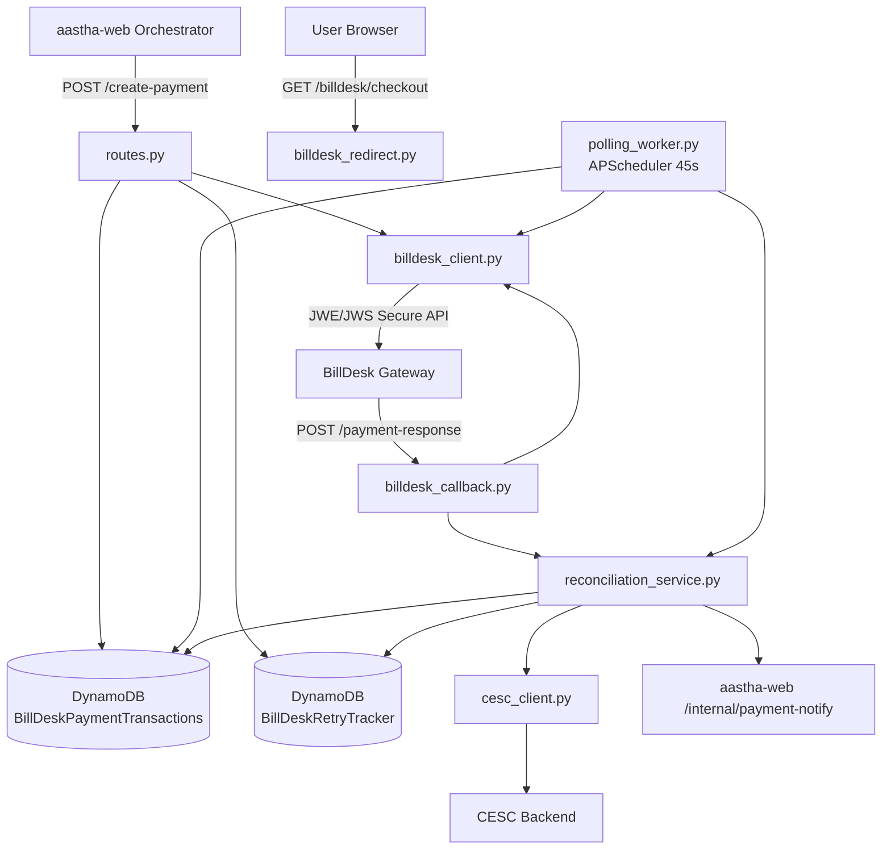
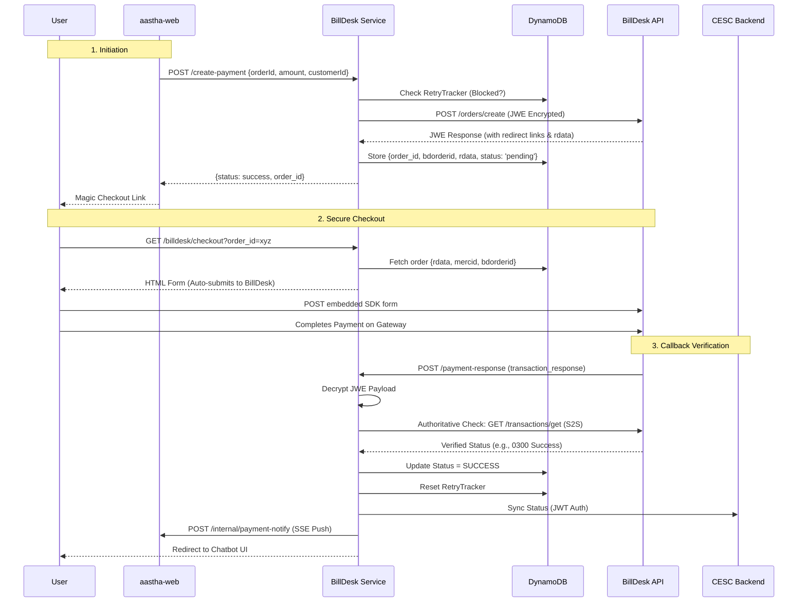

# BillDesk Microservice Architecture & Walkthrough

This document provides a comprehensive technical walkthrough of the `billdesk_service` microservice. It covers the architectural design, sequence flows, database models, and the reconciliation processes.

---

## 🏗️ Architecture Overview

The `billdesk_service` is an independent FastAPI microservice responsible for orchestrating payments via the **BillDesk Neo API**. It ensures secure communication using JWE/JWS JOSE encryption, manages payment state via DynamoDB, enforces retry limits, and syncs transaction statuses with both the user (via SSE) and the CESC backend.

### High-Level Component Diagram

---

## 🔄 End-to-End Payment Flow (Sequence)

The payment process involves a 3-step orchestration flow separated into distinct routes to ensure security and robust state management.

---

## 🧩 Component Breakdown

### 1. API Routes
*   **`create-payment` (`routes.py`)**: 
    *   **Retry Guard:** Checks `BillDeskRetryTracker` in DynamoDB. If the customer has failed 3 times, throws a 429 Retry Blocked exception.
    *   **Order Creation:** Calls `billdesk_client.create_order`.
    *   **Sanitization:** Extracts the immutable `rdata`, `bdorderid`, `mercid`, and `redirect_url` from the BillDesk response.
    *   **State Persistence:** Saves the order in `BillDeskPaymentTransactionsV2` with `status="pending"`.
*   **`checkout` (`billdesk_redirect.py`)**: 
    *   **Sanitization:** Cleans the `order_id` string.
    *   **HTML Generation:** Fetches the `rdata` from DynamoDB and generates a pristine, auto-submitting HTML form pointing to the BillDesk Neo Embedded SDK URL.
*   **`payment-response` (`billdesk_callback.py`)**: 
    *   **Decryption:** Takes the URL-encoded `transaction_response` from BillDesk and decrypts the JWE/JWS payload.
    *   **Authoritative Verification:** Does *not* blindly trust the callback payload. It makes a secure Server-to-Server (S2S) call (`get_transaction_status`) to BillDesk to verify the ground truth.
    *   **Reconciliation:** Hands off the verified payload to `reconciliation_service.py`.

### 2. BillDesk SDK / Client (`billdesk_client.py`)
Implements the rigid security specifications required by the BillDesk Neo API.
*   **JWE/JWS Encryption**: Every request payload is signed and encrypted using `create_jwe_jws`. Every response is decrypted using `decrypt_jwe_jws` (from `app.core.security`).
*   **Headers**: Enforces strict `BD-Traceid`, `BD-Timestamp` (YYYYMMDDHHMMSS format in IST), and `BD-MerchantId` headers.
*   **Endpoints**: Interacts with `/orders/create` and `/transactions/get`.

### 3. Reconciliation Service (`reconciliation_service.py`)
Acts as the central nervous system for finalizing a payment, shared by both the real-time callback and the background polling worker.
*   **Status Mapping**: Maps BillDesk's `0300` to `SUCCESS` and `0399` to `FAILED`.
*   **DynamoDB Update**: Commits the final status and `transaction_id`.
*   **Retry Tracker**: If success, resets `failed_attempts` to 0. If failure, increments attempts. If attempts reach 3, blocks the customer for 30 minutes.
*   **CESC Sync**: Uses `map_to_cesc_payload` to format a 30-field dictionary, gets a JWT token via `cesc_client`, and pushes the status to the CESC backend.
*   **SSE Notification**: Calls `aastha-web:8001/internal/payment-notify` (authenticated via `X-Internal-Secret`) to push a real-time message to the user's WhatsApp or Web interface.

### 4. Background Polling Worker (`polling_worker.py`)
Handles edge cases where a user closes their browser mid-payment, meaning the callback is never fired.
*   **Mechanism**: Uses `APScheduler` (AsyncIOScheduler) running every **45 seconds**.
*   **Query**: Scans DynamoDB for records where `status == PENDING` and `attempts < 3`.
*   **Action**: For each record, calls `get_transaction_status` on BillDesk.
*   **Resolution**:
    *   If `0300` or `0399`, it triggers `reconcile_payment()`.
    *   If still pending and `attempts` reach 3 (approx 2.5 minutes), it marks the order as `TIMEOUT_PENDING` in DB and syncs with CESC as `PENDING`.

---

## 🗄️ Database Schemas (DynamoDB)

The service relies on two `PAY_PER_REQUEST` DynamoDB tables (`models.py`).

### Table 1: `BillDeskPaymentTransactionsV2`
| Field | Type | Description |
| :--- | :--- | :--- |
| `order_id` | String (PK) | Internal CESC-generated order ID |
| `transaction_id` | String | BillDesk's `bdorderid` |
| `customer_id` | String | The CESC 11-digit CID |
| `amount` | Number/String | Transaction amount |
| `rdata` | String | Immutable encrypted blob required for checkout |
| `status` | String | `INITIATED`, `PENDING`, `SUCCESS`, `FAILED`, `TIMEOUT_PENDING` |
| `attempts` | Number | Tracks polling iterations |
| `created_at` | String | ISO Timestamp |

### Table 2: `BillDeskRetryTracker`
| Field | Type | Description |
| :--- | :--- | :--- |
| `customer_id` | String (PK) | The CESC 11-digit CID |
| `failed_attempts` | Number | Count of consecutive failures |
| `blocked_until` | String | ISO Timestamp (Null if not blocked) |
| `last_failed_at` | String | ISO Timestamp |

---

## 🔐 Security Posture

1.  **JWE/JWS Cryptography:** All PII and financial payload data exchanged with BillDesk is fully encrypted using standard JOSE protocols.
2.  **Internal Network Isolation:** The `/internal/payment-notify` endpoint is secured with an `INTERNAL_SECRET` header to prevent unauthorized internal triggering.
3.  **Authoritative S2S Checks:** Callbacks are never trusted blindly. The service independently queries the gateway API to prevent malicious callback spoofing.
4.  **AWS Identity:** DynamoDB access uses strict `AWS_ACCESS_KEY_ID` and `AWS_SECRET_ACCESS_KEY` resolution via `.env` or IAM roles, avoiding hardcoded secrets in the code.
5.  **DDoS / Abuse Protection:** The `BillDeskRetryTracker` prevents card testing or system spamming by enforcing a strict 3-attempt limit per CID.
