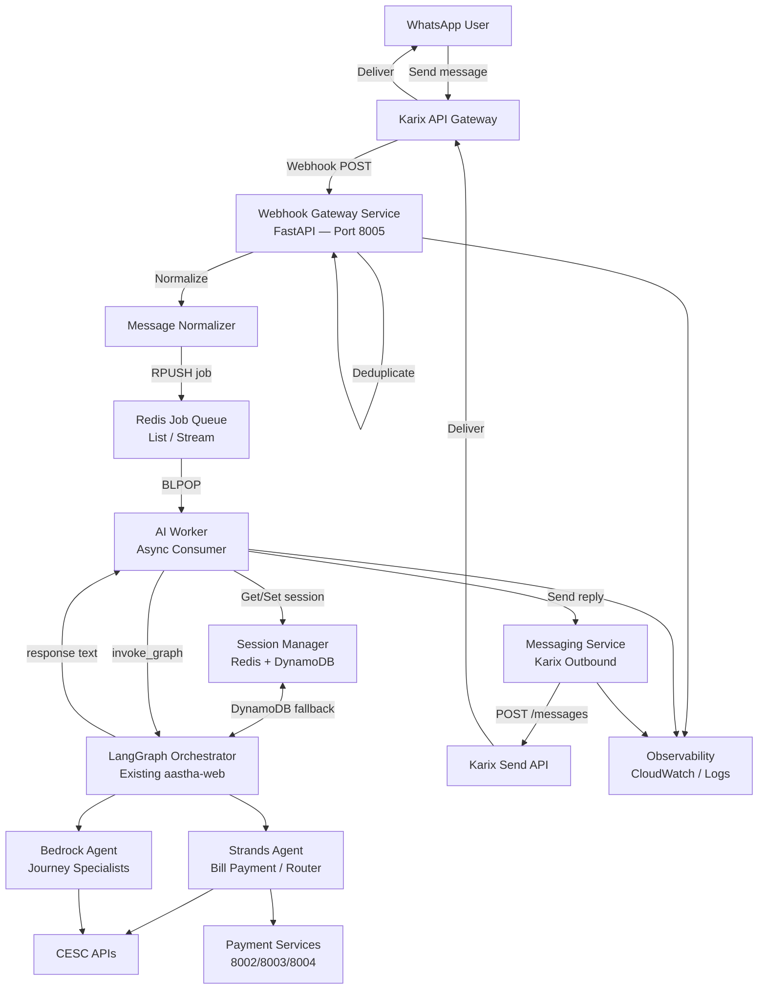
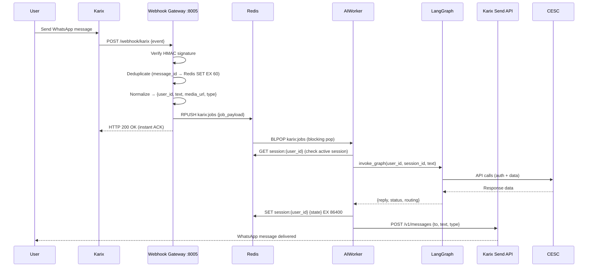

# AASTHA AI — Karix WhatsApp Integration Enterprise Report (Part 2 of 3)
## Architecture Design · Microservices · Redis Strategy · Async Queue · Karix Questionnaire

---

# 7. Target WhatsApp Architecture

## 7.1 Full System Architecture



## 7.2 Async Processing Flow



---

# 8. Required Microservice Specifications

## Service 1 — Webhook Gateway (NEW — Port 8005)

**Priority:** 🔴 Critical — must build first

```python
# Required endpoints
POST /webhook/karix          # Karix inbound events
GET  /health                 # Health check

# Responsibilities
1. Verify Karix HMAC signature (X-Karix-Signature header)
2. Parse Karix event schema into normalized internal format
3. Deduplicate using message_id (Redis SET NX EX 60)
4. Publish to Redis job queue (RPUSH karix:jobs)
5. Return 200 OK immediately (Karix expects fast ACK)
6. Handle: text, image, audio, video, document, location, interactive events

# Normalized message format (internal)
{
    "job_id": "uuid",
    "user_id": "91XXXXXXXXXX",        # WhatsApp phone number
    "message_id": "wamid.xxx",        # Karix message ID
    "timestamp": "2026-05-13T...",
    "channel": "whatsapp",
    "type": "text|audio|image|document|button|list_reply",
    "text": "User message text",
    "media": {
        "url": "https://karix.../media/xxx",
        "mime_type": "audio/ogg",
        "filename": null
    },
    "interactive": {
        "type": "button_reply|list_reply",
        "payload": "BUTTON_ID",
        "title": "Button text"
    },
    "session_id": "auto-generated or from Redis"
}
```

## Service 2 — AI Worker (NEW — Async Consumer)

**Priority:** 🔴 Critical

```python
# Pattern: Redis BLPOP consumer loop

async def worker_loop():
    while True:
        _, raw = await redis.blpop("karix:jobs", timeout=0)
        job = json.loads(raw)
        await process_job(job)

async def process_job(job: dict):
    user_id = job["user_id"]
    
    # 1. Resolve session_id
    session_id = await redis.get(f"session:{user_id}") or str(uuid.uuid4())
    
    # 2. Handle media (download from Karix if audio/image)
    text = job.get("text") or await transcribe_audio(job["media"]["url"])
    
    # 3. Invoke LangGraph (existing invoke_graph function — reused unchanged)
    result = await asyncio.to_thread(
        invoke_graph, user_id, session_id, text,
        audio_path=None, channel="whatsapp"
    )
    
    # 4. Extract reply
    reply = extract_reply(result)
    
    # 5. Chunk reply if > 4096 chars (WhatsApp limit)
    chunks = chunk_message(reply, max_len=4096)
    
    # 6. Send via Messaging Service
    for chunk in chunks:
        await messaging_client.send_text(user_id, chunk)
    
    # 7. Persist session
    await redis.setex(f"session:{user_id}", 86400, session_id)
```

## Service 3 — Session Manager (Redis-backed)

**Priority:** 🟡 High

```python
# Redis key schema
session:{user_id}           → session_id string (TTL: 24h)
lock:{user_id}              → distributed lock (TTL: 30s, prevents duplicate processing)
dedup:{message_id}          → "1" (TTL: 60s, deduplication)
typing:{user_id}            → "1" (TTL: 5s, typing indicator state)
waba_window:{user_id}       → timestamp (TTL: 24h, WhatsApp session window)

# DynamoDB fallback (existing)
Table: aastha-langgraph-checkpoints   → LangGraph conversation state
Table: UserNotifications              → Notification history
```

## Service 4 — Messaging Service (NEW)

**Priority:** 🔴 Critical

```python
# Karix outbound message schemas

# Text message
POST https://api.karix.io/v1/messages
{
    "to": "91XXXXXXXXXX",
    "type": "text",
    "text": {"body": "Your reply here"},
    "messaging_product": "whatsapp"
}

# Template message (for cold-start / 24h window expired)
{
    "to": "91XXXXXXXXXX",
    "type": "template",
    "template": {
        "name": "bill_payment_followup",
        "language": {"code": "en"},
        "components": [{"type": "body", "parameters": [...]}]
    }
}

# Interactive buttons (for payment gateway selection)
{
    "to": "91XXXXXXXXXX",
    "type": "interactive",
    "interactive": {
        "type": "button",
        "body": {"text": "Choose your payment method:"},
        "action": {
            "buttons": [
                {"type": "reply", "reply": {"id": "RAZORPAY_RBL", "title": "RBL Bank"}},
                {"type": "reply", "reply": {"id": "RAZORPAY_AXIS", "title": "Axis Bank"}},
                {"type": "reply", "reply": {"id": "BILLDESK", "title": "Net Banking"}}
            ]
        }
    }
}

# Responsibilities
- Retry with exponential backoff on 429/5xx
- Track delivery status (update DynamoDB on delivered/read)
- Rate limiting: respect Karix per-second limits
- Template fallback when 24h session window expired
```

## Service 5 — RAG Service (NEW — Optional Phase 2)

**Priority:** 🟢 Phase 2

```
Current state: Bedrock Agents with Lambda action groups handle knowledge retrieval.
No standalone RAG exists. Build if Bedrock Agent latency is unacceptable.

Recommended stack if needed:
- Embeddings: Amazon Titan Embeddings v2
- Vector DB: Amazon OpenSearch Serverless (existing AWS infra)
- Chunking: Fixed-size + sentence-boundary
- Retrieval: Top-K semantic search
- Reranking: Claude Haiku cross-encoder

Use cases for CESC:
- FAQ retrieval (tariff schedules, disconnection policies)
- Outage notifications by area
- Document Q&A (uploaded bills)
```

## Service 6 — Observability (NEW)

**Priority:** 🟡 High

```
Recommended Stack (AWS-native, no new infra):
- Structured logging: Python structlog → CloudWatch Logs
- Metrics: boto3 CloudWatch.put_metric_data()
  - Messages processed/min
  - LangGraph latency p50/p95/p99
  - CESC API error rate
  - Karix delivery rate
  - Redis queue depth
- Tracing: AWS X-Ray (add aws-xray-sdk to requirements)
- AI observability: LangSmith (already configured, set LANGCHAIN_TRACING_V2=true)
- Dashboards: CloudWatch Dashboard
```

---

# 9. Redis Architecture Strategy

## 9.1 Recommended Hybrid Memory Model

```
┌─────────────────────────────────────────────────────┐
│                  HYBRID MEMORY                       │
├──────────────────────┬──────────────────────────────┤
│   Redis (Operational)│  DynamoDB/LangGraph (AI)     │
├──────────────────────┼──────────────────────────────┤
│ Job Queue            │ Conversation checkpoints      │
│ Session mapping      │ AgentState (full schema)      │
│ Deduplication        │ Interrupt/resume state        │
│ Distributed locks    │ Journey progress              │
│ 24h window tracking  │ OTP verification state        │
│ Typing indicators    │ Payment order context         │
│ Rate limit counters  │ Complaint/docket history      │
└──────────────────────┴──────────────────────────────┘
```

## 9.2 Redis Configuration

```yaml
# docker-compose.yml addition
redis:
  image: redis:7-alpine
  ports:
    - "6379:6379"
  command: redis-server --maxmemory 512mb --maxmemory-policy allkeys-lru
  networks:
    - aastha-network
  healthcheck:
    test: ["CMD", "redis-cli", "ping"]
    interval: 10s
    timeout: 5s
    retries: 3
```

```python
# requirements addition
redis==5.0.4
aioredis==2.0.1   # for async worker
```

## 9.3 Redis Key Design

| Key Pattern | Type | TTL | Purpose |
|---|---|---|---|
| `karix:jobs` | List | None | RPUSH/BLPOP job queue |
| `karix:dlq` | List | None | Dead letter queue (failed jobs) |
| `session:{user_id}` | String | 24h | Active session_id mapping |
| `lock:{user_id}` | String | 30s | Per-user processing lock |
| `dedup:{message_id}` | String | 60s | Message deduplication |
| `waba_window:{user_id}` | String | 24h | WhatsApp 24h session window |
| `retry:{user_id}:{job_id}` | String | 1h | Retry attempt counter |
| `metrics:processed` | Counter | None | Messages processed total |

---

# 10. Karix Team Questionnaire (Required Before Implementation)

## 10.1 Authentication & Access

```
□ Q1: What authentication method does Karix use?
      - API key (header: X-Api-Key or Authorization: Bearer)?
      - OAuth 2.0 client credentials?
      - Both?

□ Q2: Is IP whitelisting required on Karix's side?
      - Our EC2 elastic IP: 3.7.96.49 — must this be whitelisted?

□ Q3: What are the API rate limits?
      - Messages per second per WABA number?
      - API calls per minute (auth, media, status)?
      - What is the retry behavior when rate limited (429)?

□ Q4: How does webhook signature validation work?
      - HMAC-SHA256? Which header carries the signature?
      - What is the signing key — same as API key or separate?
      - Is the raw request body used for signing (not parsed JSON)?

□ Q5: Do you provide a webhook test/simulation tool?
```

## 10.2 Inbound Webhook Schema

```
□ Q6: Provide the full JSON schema for inbound webhook events.
      Specifically for:
      - Text messages
      - Audio/voice notes
      - Images
      - Documents (PDF)
      - Location sharing
      - Interactive button replies
      - Interactive list replies
      - Delivery status updates (sent/delivered/read/failed)
      - Template status updates

□ Q7: What is the webhook retry policy?
      - How many retries if our endpoint returns non-200?
      - What is the retry interval?
      - Is there exponential backoff?
      - Maximum retry window?

□ Q8: Are duplicate events possible?
      - What field should we use as idempotency key? (message ID?)
      - Can the same message_id arrive multiple times?

□ Q9: What is the HTTP timeout for webhook delivery?
      - How long does Karix wait for our 200 OK?
      - Do we need to ACK immediately and process async?
```

## 10.3 Outbound Messaging API

```
□ Q10: Provide the full API specification for:
       - Sending text messages
       - Sending template messages
       - Sending interactive button messages
       - Sending interactive list messages
       - Sending media (image, audio, document)
       - Sending location

□ Q11: What is the base URL for the Karix API?
        UAT: ?
        Production: ?

□ Q12: For media messages — do we upload media first then reference by ID,
       or can we send a URL directly?

□ Q13: What is the maximum message body length?
        (WhatsApp limit is 4096 chars — does Karix enforce this?)
```

## 10.4 WhatsApp Business Account Operations

```
□ Q14: What is the WABA onboarding process?
       - Documents required from CESC?
       - Timeline for approval?
       - Does Karix handle Facebook Business Manager setup?

□ Q15: What is the WhatsApp number registration process?
       - Can we use CESC's existing WhatsApp Business number?
       - Or does Karix provision a new number?

□ Q16: Template message approval:
       - What is the approval timeline? (Meta review)
       - Does Karix provide a template management UI?
       - Which templates do we need for CESC?
         (bill payment link, OTP, payment confirmation, outage alert)

□ Q17: What is the 24-hour session window behavior?
       - Can we send free-form text within the 24h window?
       - After 24h, must we use approved templates only?
       - Does Karix notify us when a session expires?
```

## 10.5 Media & Audio

```
□ Q18: How do we download incoming media (voice notes, images)?
       - Does the webhook include a media URL or media ID?
       - If media ID, what API do we call to download?
       - Authentication for media download?
       - Expiry of media URLs?

□ Q19: What audio formats are sent by WhatsApp?
       - OGG/Opus? AMR? MP4?
       - Does Karix transcode to a standard format?
```

## 10.6 Reliability & Security

```
□ Q20: What are Karix's uptime SLAs?
□ Q21: Do you provide webhook delivery logs / dashboards?
□ Q22: Is payload encryption supported (beyond HTTPS)?
□ Q23: How is GDPR/data residency handled?
       - Is message content stored on Karix servers?
       - For how long?
□ Q24: Do you support audit logs for all API calls?
□ Q25: Is there a sandbox/UAT environment?
       - URL?
       - Test phone numbers?
       - How to simulate incoming messages?
```

## 10.7 Advanced Features

```
□ Q26: Interactive messages:
       - Button messages (up to 3 buttons)?
       - List messages (up to 10 items)?
       - Flow messages?

□ Q27: Human handoff:
       - Does Karix support agent handoff APIs?
       - Can we pause AI and route to human agent?
       - Is there a CRM integration?

□ Q28: Pricing model:
       - Per-message pricing?
       - Session-based pricing?
       - Utility vs Marketing vs Service message costs?
       - Volume discounts?
```

---

# 11. Missing Components — Implementation Priority

## Phase 1 — Immediate (Karix Integration MVP)

| Component | File(s) to Create | Effort |
|---|---|---|
| Webhook Gateway Service | `karix_service/main.py`, `karix_service/routes/webhook.py` | 3 days |
| Karix signature validator | `karix_service/security/signature.py` | 0.5 days |
| Message normalizer | `karix_service/normalizers/karix_normalizer.py` | 1 day |
| Redis job publisher | `karix_service/queue/publisher.py` | 0.5 days |
| AI Worker (Redis consumer) | `ai_worker/worker.py` | 2 days |
| Messaging Service (outbound) | `messaging_service/karix_client.py` | 2 days |
| Message chunker | `utils/message_chunker.py` | 0.5 days |
| Redis setup | `docker-compose.yml` update | 0.5 days |

**Total Phase 1: ~10 developer days**

## Phase 2 — Enhanced WhatsApp UX

| Component | Purpose | Effort |
|---|---|---|
| Interactive button renderer | Convert agent text choices to WA buttons | 3 days |
| Template manager | Send approved templates when 24h window expired | 2 days |
| Media downloader + transcriber | Process Karix audio via AWS Transcribe | 2 days |
| Typing indicator sender | Send "typing..." while AI processes | 0.5 days |
| Delivery status tracker | Track sent/delivered/read in DynamoDB | 1 day |

**Total Phase 2: ~8.5 developer days**

## Phase 3 — Production Hardening

| Component | Purpose | Effort |
|---|---|---|
| Dead letter queue + alerting | Failed job retry with human escalation | 2 days |
| Distributed user lock | Prevent duplicate processing (Redis SETNX) | 1 day |
| Structured logging | CloudWatch-compatible JSON logs | 2 days |
| X-Ray tracing | End-to-end request tracing | 1 day |
| Per-user rate limiting | Prevent abuse (Redis counter) | 1 day |
| Circuit breaker (CESC) | Fail gracefully when CESC is down | 2 days |

**Total Phase 3: ~9 developer days**

---
