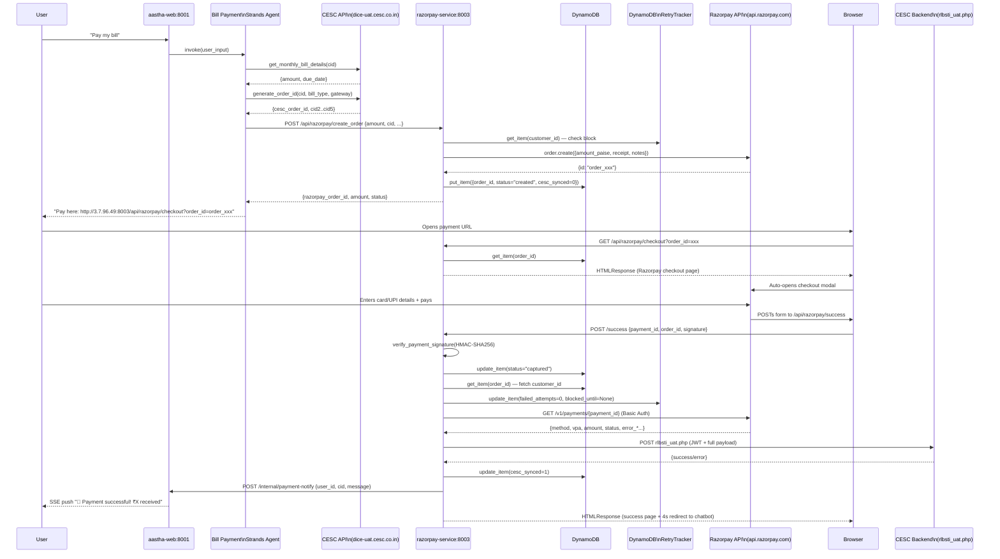
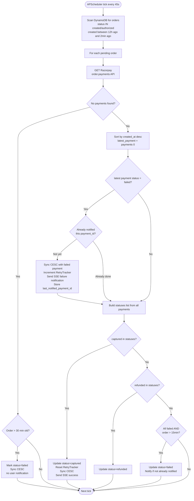

# AASTHA AI — Bill Payment System: Reviewer-Grade Intelligence Report
## Part 1: Architecture · API Reference · Payment Flow Analysis


---

# ARCHITECTURE_OVERVIEW

## Service Topology (Verified from docker-compose.yml)

```
Internet / Browser / WhatsApp
         │
         ▼
aastha-web (Port 8001)          ← PRIMARY ENTRY — AI Orchestration + SSE
    ├── Depends on → billdesk-service:8002
    ├── Depends on → razorpay-service:8003
    └── Depends on → razorpay-axis-service:8004
         │
         └── aastha-network (Docker Bridge)
              ├── billdesk-service:8002
              ├── razorpay-service:8003
              └── razorpay-axis-service:8004
```


## Docker Infrastructure

| Container | Image Built From | Port | Network | Restart | Health Check |
|---|---|---|---|---|---|
| `aastha-web` | `./Dockerfile` | 8001 | aastha-network | unless-stopped | `curl localhost:8001/health` @20s |
| `billdesk-service` | `./billdesk_service/Dockerfile` | 8002 | aastha-network | unless-stopped | `curl localhost:8002/health` @30s |
| `razorpay-service` | `./razorpay_service/Dockerfile` | 8003 | aastha-network | unless-stopped | `curl localhost:8003/docs` @30s |
| `razorpay-axis-service` | `./razorpay_axis_service/Dockerfile` | 8004 | aastha-network | unless-stopped | `curl localhost:8004/docs` @30s |

**Key Finding:** `aastha-web` healthcheck targets `/health`, but `razorpay-service` and `razorpay-axis-service` target `/docs` — meaning the health gate is satisfied even if the payment routes fail to load, as long as Swagger docs render.

## Startup Sequence (Verified from main.py)

```
razorpay-service starts:
  1. create_tables()              → DynamoDB: create RazorpayPaymentOrders + RetryTracker if missing
  2. @asynccontextmanager lifespan
     → start_polling_worker()     → APScheduler BackgroundScheduler starts (45s interval)
  3. FastAPI app registered
     → /api/razorpay/* routes included
     → /health route included
  4. uvicorn starts on 0.0.0.0:8003

razorpay-axis-service: IDENTICAL to above (port 8004, table: RazorpayAxisPaymentOrders)

aastha-web starts AFTER all three payment services are healthy (depends_on)
```

---

# API_REFERENCE

## razorpay-service (Port 8003) — Complete Endpoint Registry (Verified)

### `POST /api/razorpay/create_order`
| Field | Value |
|---|---|
| **Handler** | `create_order()` in `app/api/routes.py` |
| **Auth** | None (internal network only in Docker) |
| **Purpose** | Create a new Razorpay order and persist to DynamoDB |
| **Request Schema** | `OrderRequest` — see below |
| **Response Schema** | `OrderResponse` |
| **Side Effects** | Razorpay API call, DynamoDB `put_item` |
| **Retry Guard** | Checks `RetryTracker` first — raises HTTP 429 if blocked |
| **Failure Mode** | Returns 500 on Razorpay API error, 429 on retry block |

**Request Schema (`OrderRequest`):**
```json
{
  "amount": 500.00,           // Required — INR rupees (not paise)
  "currency": "INR",          // Default: "INR"
  "customer_id": "80401016255",  // CID (11-digit LT ID)
  "bill_type": "12",          // CESC bill type code
  "mobile": "9874572386",     // Registered mobile
  "cid2": "039401426",        // Secondary CESC identifier
  "cid3": "1",                // Payment gateway code
  "cid4": "1",                // p8_val
  "cid5": "",                 // p9_val
  "user_id": "91XXXXXXXXXX",  // For SSE notification routing
  "session_id": "abc123"      // LangGraph session context
}
```

**Response Schema:**
```json
{
  "razorpay_order_id": "order_SXxxxxxxxxxx",
  "amount": 500.00,
  "currency": "INR",
  "status": "created"
}
```

---

### `GET /api/razorpay/checkout`
| Field | Value |
|---|---|
| **Handler** | `checkout_page()` |
| **Auth** | None — publicly accessible |
| **Purpose** | Serve HTML page that auto-opens Razorpay payment modal |
| **Query Params** | `order_id` (required), `amount` (fallback) |
| **Response** | `HTMLResponse` — full Razorpay checkout page |
| **Side Effects** | DynamoDB `get_item` to fetch order; creates new order if no `order_id` |
| **Security** | Callback URL built dynamically using `request.url_for()` + X-Forwarded-Proto |
| **JS Behaviour** | Modal opens automatically on `window.onload`; fallback button shown after 3s if modal fails |

---

### `POST /api/razorpay/success`
| Field | Value |
|---|---|
| **Handler** | `payment_success()` |
| **Auth** | None — triggered by Razorpay form POST (browser redirect) |
| **Purpose** | Verify HMAC signature → update DynamoDB → sync CESC → send SSE → return success HTML |
| **Request** | Form data: `razorpay_payment_id`, `razorpay_order_id`, `razorpay_signature` |
| **Response** | `HTMLResponse` (success page with 4s auto-redirect back to chatbot) |
| **Critical Path** | 7-step execution chain — see Payment Flow below |
| **Failure Mode** | Returns 400 if signature invalid; CESC sync failure is logged but non-fatal |

---

### `GET /api/razorpay/order-status/{order_id}`
| Field | Value |
|---|---|
| **Handler** | `check_order_status()` |
| **Purpose** | Poll payment status (used by bill payment agent tools) |
| **Response** | `{order_id, status, amount, cesc_synced}` |
| **DB Op** | DynamoDB `get_item` by `razorpay_order_id` (PK lookup — O(1)) |
| **Failure Mode** | 404 if order not found, 500 on DB error |

---

### `GET /api/razorpay/orders`
| Field | Value |
|---|---|
| **Handler** | `get_all_orders()` |
| **Purpose** | Debug endpoint — returns all orders via table scan |
| **⚠️ Risk** | `table.scan()` on full DynamoDB table — O(N) cost, no auth, exposes all order data |

---

### `GET /api/razorpay/retry-status`
| Field | Value |
|---|---|
| **Handler** | `retry_status()` |
| **Query Param** | `customer_id` |
| **Purpose** | Check if a customer is currently retry-blocked |
| **Response** | `{customer_id, is_blocked, blocked_until, failed_attempts}` |

---

### `GET /health`
| Field | Value |
|---|---|
| **Response** | `{"status": "ok", "service": "razorpay_service"}` |
| **Note** | razorpay-axis-service returns `"service": "razorpay_axis_service"` |

---

## razorpay-axis-service (Port 8004)
**Identical endpoint surface** to razorpay-service. Differences:
- Uses `RAZORPAY_KEY_ID` / `RAZORPAY_KEY_SECRET` from `razorpay_axis_service/.env` (Axis Bank keys)
- DynamoDB table: `RazorpayAxisPaymentOrders`
- Logger name: `razorpay_axis_worker`

---

# PAYMENT_FLOW_ANALYSIS

## Razorpay RBL — Full Payment Lifecycle



## `payment_success()` — 7-Step Execution Chain (Verified)

```
Step 1: HMAC Signature Verification
  → verify_payment_signature(order_id, payment_id, signature)
  → Uses RAZORPAY_KEY_SECRET
  → Raises HTTP 400 if invalid

Step 2: DynamoDB Status Update
  → table.update_item(status="captured")

Step 3: Retry Tracker Reset
  → get_item(order_id) to find customer_id
  → tracker_table.update_item(failed_attempts=0, blocked_until=None)

Step 4: Razorpay Payment Detail Fetch
  → GET api.razorpay.com/v1/payments/{payment_id}
  → Basic Auth (KEY_ID:KEY_SECRET)
  → Timeout: 15s

Step 5: CESC Payload Construction
  → map_to_cesc_payload(order, payment_details)
  → Builds 20-field payload from DynamoDB order + Razorpay response

Step 6: CESC Backend Sync
  → cesc_client.update_payment_status(payload)
  → Gets fresh JWT first (dual-step auth, 2 HTTP calls)
  → POST https://srvcs.cesc.co.in/soi49Kkdu/rlbsti_uat.php
  → Timeout: 30s

Step 7: SSE Notification
  → POST http://aastha-web:8001/internal/payment-notify
  → Header: X-Internal-Secret: cesc-secret-2026
  → Timeout: 10s
  → Delivers user-facing success message via SSE
```

## Polling Worker — Parallel Detection Path



## CESC Authentication Flow (Dual-Step JWT — Verified)

```
cesc_client._get_jwt_token():

  Request 1:
    GET https://dice-uat.cesc.co.in/dicekey/botKeyStore.txt
    Headers: User-Agent: Mozilla/5.0
    Timeout: 10s
    → Returns: raw text (initial_token / client_token_vl)

  Request 2:
    POST https://dice-uat.cesc.co.in/api/getSecretKey
    Body: {"client_token_vl": "<initial_token>"}
    Headers: Content-Type: application/json
    Timeout: 10s
    → Returns: {"access_token": "<JWT>"}

  Returns: JWT string

cesc_client.update_payment_status(payload):
  1. _get_jwt_token()           → 2 HTTP calls (above)
  2. Inject bearer_token into payload body (CESC requires it in both header AND body)
  3. POST https://srvcs.cesc.co.in/soi49Kkdu/rlbsti_uat.php
     Headers: Authorization: Bearer <JWT>
     Timeout: 30s
  4. Return {success: True/False, response/error}
```

**⚠️ Risk:** CESC SYNC adds **minimum 2 HTTP calls + 1 payment sync call = 3 blocking network calls** per payment success event. These are all synchronous within the `payment_success` handler, adding 10-30s to the callback processing time. The browser is blocked waiting for the success HTML during this entire chain.

## CESC Payload Mapping (Verified from `map_to_cesc_payload`)

| CESC Field | Source | Value |
|---|---|---|
| `param_1` | DynamoDB `customer_id` | CID (LT/HT consumer ID) |
| `param_2` | DynamoDB `cid2` | Secondary CESC ID |
| `param_3` | DynamoDB `bill_type` | CESC bill type code (1-13) |
| `param_4` | **HARDCODED** | `"10.50.81.31"` (UAT IP) |
| `param_5` | DynamoDB `mobile` | Registered mobile number |
| `param_6` | **HARDCODED** | `"1"` (WhatsApp channel) |
| `param_7` | DynamoDB `cid3` | Payment gateway code |
| `param8` | DynamoDB `cid4` | p8_val |
| `param9` | DynamoDB `cid5` | p9_val |
| `bearer_token` | Injected by `CescClient` | Live JWT (not from DB) |
| `note` | DynamoDB `customer_id` | = param_1 |
| `id` | Razorpay `payment.id` | Razorpay payment ID |
| `amount` | Razorpay `payment.amount` | Amount in paise |
| `status` | Razorpay `payment.status` | captured/failed |
| `method` | Razorpay `payment.method` | upi/card/netbanking |
| `vpa` | Razorpay `payment.vpa` | UPI VPA if applicable |
| `error_code` | Razorpay `payment.error_code` | Failure code |
| `error_description` | Razorpay `payment.error_description` | Failure reason |
| `captured` | Razorpay `payment.captured` | true/false string |
| `currency` | Razorpay `payment.currency` | INR |

---
