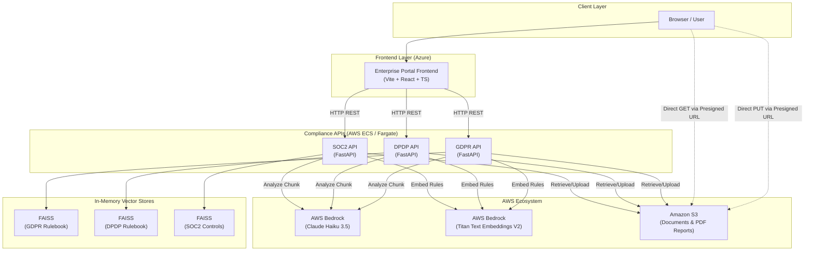

# Praeferre GRC Platform — Enterprise Architecture Walkthrough

## 1. Platform Overview

Praeferre is an enterprise-grade **Governance, Risk & Compliance (GRC)** platform. It uses a suite of independent microservices to analyze organizational policies against global regulatory frameworks (GDPR, DPDP, SOC2, POPIA). 

The platform has recently been upgraded to an **AWS-native architecture**, shifting from third-party LLMs and local storage to a fully integrated AWS Bedrock and Amazon S3 ecosystem.

### Services Inventory

| # | Service | Tech Stack | AI & Storage |
|---|---------|-----------|-------------|
| 1 | **Enterprise Portal Frontend** | Vite + React + TypeScript | Azure App Service (Hosting) |
| 2 | **GDPR API** (`gdpr-api-gdpr-api-bedrock`) | FastAPI + LangChain | Bedrock (Claude) + S3 |
| 3 | **DPDP API** (`dpdp-api-dpdp-api-bedrock-clean`) | FastAPI + LangChain | Bedrock (Claude) + S3 |
| 4 | **SOC2 API** (`soc2-api-feature-soc2-bedrock`) | FastAPI + ReportLab | Bedrock (Claude) + S3 |
| 5 | **POPIA API** (`popia-api-main`) | FastAPI | Bedrock (Claude) + FAISS |
| 6 | **Privacy Emulator** (`privacy-api-emulator-main`) | FastAPI + Presidio | Local PII Redaction Guardrail |

---

## 2. High-Level AWS Architecture

---

## 3. The New AWS Integration Flow

The backend repositories have been heavily refactored to support stateless execution and scale seamlessly on AWS.

### 3.1 Direct-to-S3 Uploads (Zero-Touch Backend)
To prevent large file uploads from consuming memory on the API servers, the platform now uses a presigned URL pattern:
1. The frontend requests an upload URL (`GET /scans/upload-url`).
2. The backend generates a temporary AWS S3 presigned URL using `boto3`.
3. The browser uploads the document **directly to S3**.
4. The frontend triggers the analysis by passing the `s3_key` to the backend (`POST /analyze/from-s3`).
5. The backend streams the file from S3 into memory just in time for text extraction.

### 3.2 AWS Bedrock RAG Engine
All compliance engines (GDPR, DPDP, SOC2) share a unified Retrieval-Augmented Generation (RAG) architecture:
*   **Embeddings:** Master regulatory rulebooks are embedded using `amazon.titan-embed-text-v2:0` via Bedrock.
*   **Vector Search:** FAISS runs locally in-memory to find relevant regulatory clauses for the uploaded policy text.
*   **LLM Analysis:** Analysis is dispatched concurrently to `eu.anthropic.claude-haiku-4-5-20251001-v1:0` via Bedrock.

### 3.3 Server-Side PDF Report Generation
Instead of returning large payloads for the frontend to render, the backends now include `report_generator.py` (powered by ReportLab). 
1. The API compiles the Bedrock analysis into a branded PDF.
2. The PDF is uploaded directly to S3.
3. The API returns a secure, presigned download link to the user.

---

## 4. Service Deep Dives

### 4.1 SOC2 Compliance API (`soc2-api-feature-soc2-bedrock`)
A massive architectural simplification. Previously relying on a heavy PostgreSQL + Celery/Redis background worker setup, the SOC2 engine is now a fast, stateless RAG API.
*   **Features:** Direct S3 uploads, Batch S3 analysis, Single-issue rescans (`/issues/{detail_id}/rescan`).
*   **RAG Rules:** Uses the `SOC2.pdf` control framework.
*   **Output:** Generates comprehensive PDF scorecards stored in the `grc-soc2-scans` S3 bucket.

### 4.2 GDPR & DPDP APIs (`*-bedrock-clean`)
Similar to the SOC2 API, these have been modernized:
*   **Migration:** Replaced Cohere `command-r-plus` with AWS Bedrock Claude models.
*   **Storage:** Replaced local filesystem (`results/` directories) with S3 integration.
*   **Security:** Both APIs now enforce API keys and rely on `boto3` session credentials rather than hardcoded tokens.

---

## 5. Deployment Topology

*   **Frontend:** Hosted on Azure (e.g., Azure App Services / Static Web Apps).
*   **Backends:** Designed to be containerized and run on **Amazon ECS (Elastic Container Service) with AWS Fargate**. Because the APIs are now entirely stateless (all files in S3, all LLMs externalized to Bedrock), they can automatically scale horizontally without data loss or synchronization issues.
*   **Region Considerations:** The backend uses `AWS_DEFAULT_REGION` (e.g., `eu-west-2`) for S3 bucket locality, while allowing a separate `AWS_REGION` (e.g., `eu-west-1`) for Bedrock model availability.

> [!TIP]
> **Enterprise Readiness:** The recent updates perfectly align with enterprise best practices. By decoupling storage (S3) from compute (FastAPI) and adopting managed AI (Bedrock), the Praeferre platform is now highly available, secure, and ready for production workloads.
